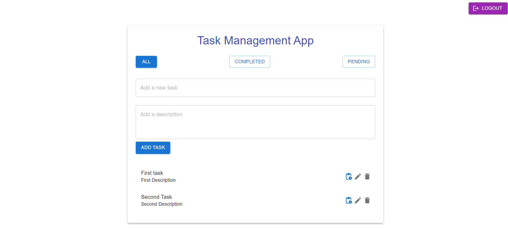

Task Management App (MERN Stack)

Welcome to the Task Management App! This project utilizes the MERN stack (MongoDB, Express.js, React.js, Node.js) to create a robust task management system.

- Setup
To run this project locally, follow these steps:

- Clone the repository:

Clone the repository using Git:

git clone https://github.com/divyanshgithub99/Decabits-task-management.git          
cd task-manager

- Install Dependencies:
Navigate to the frontend directory and install dependencies for the React app:

cd task-manager-master     
npm install

- Navigate to the backend directory and install dependencies for the Node.js server:

cd backend-deca-master         
npm install
Run the Backend Server:

- Start the backend server. Ensure it runs on port 5000:

npm start

Note: It's important to run the backend on port 5000 as specified.
Run the Frontend React App:

- Start the frontend React app:

cd task-manager-master        
npm start

Enjoy!!!!!

